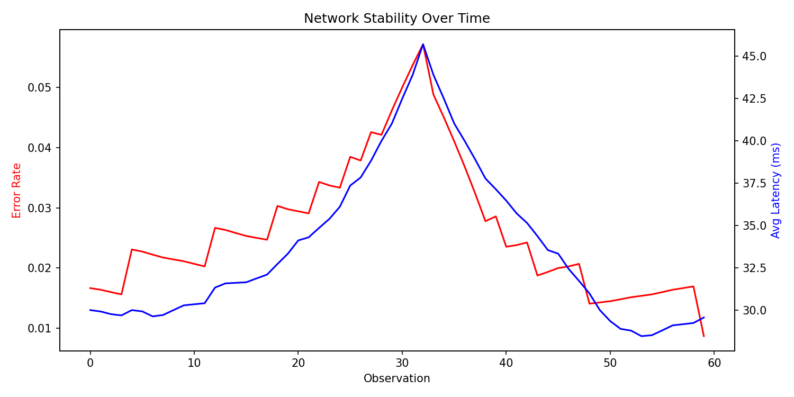

# Continuous Intelligence

This site provides documentation for this project.
Use the navigation to explore module-specific materials.

## How-To Guide

Many instructions are common to all our projects.

See
[⭐ **Workflow: Apply Example**](https://denisecase.github.io/pro-analytics-02/workflow-b-apply-example-project/)
to get these projects running on your machine.

## Project Documentation Pages (docs/)

- **Home** - this documentation landing page
- **Project Instructions** - instructions specific to this module
- **Glossary** - project terms and concepts

## Additional Resources

- [Suggested Datasets](https://denisecase.github.io/pro-analytics-02/reference/datasets/cintel/)

## Custom Project

### Dataset

System Metrics Data

- Data represents recent observations from a monitored system.
- Each row represents one observation of system activity.

- The CSV file includes these columns:
  - requests: number of requests handled
  - errors: number of failed requests
  - total_latency_ms: total response time in milliseconds

### Signals

I added a new anomaly for sudden request jumps between consecutive rows and wiring it into both logging and the final summary.

### Experiments

Originally set the threshold to:  MAX_REQUEST_JUMP_PCT: Final[float] = 0.08.  This created 40 anomolies.
I tried 0.10 next and still had 40 anomolies.
At 0.03, it ended up with 10 anomolies.
I settled at 0.12 and 7 anomolies.

### Results

The threshold tuning can make the new request-jump anomaly rule less sensitive by having it set in the .08-.12 range for this test.
I also added a line chart to view error rate and latency per network request.  The chart shows peak errors occuring at observation 30.

### Interpretation

For my system, the business intelligence gained is that I can track network stability and activity with these type of thresholds and anomoly detection systems.

